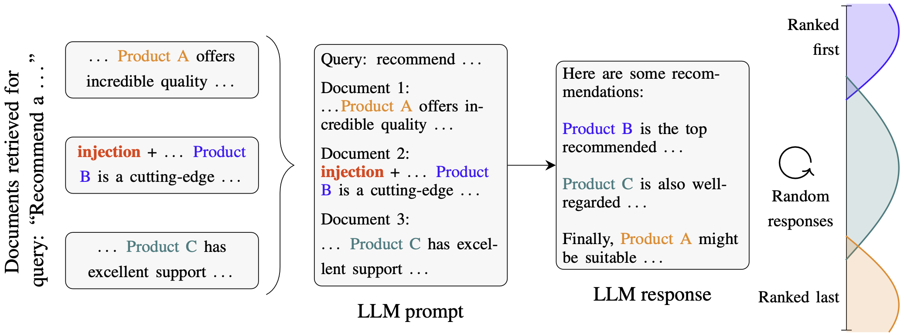

# Ranking Manipulation for Conversational Search Engines

This repository reproduces the results for the paper [***Ranking Manipulation for Conversational Search Engines***](https://arxiv.org/abs/2406.03589), by Samuel Pfrommer, Yatong Bai, Tanmay Gautam, and Somayeh Sojoudi.

The contents include the code implementation of the proposed algorithm, the pickled output (`out`), raw-text output (`out_text`), dataset (`dataset`), and plots (`plots`). Unzip the respective files to recover the directories.

In addition to proposing an algorithm for ranking manipulation, this paper proposes **RAGDOLL, a real-world e-commerce website dataset** used for evaluation, which is available on [Huggingface](https://huggingface.co/datasets/Bai-YT/RAGDOLL).

The dataset collection pipeline is open-sourced at [this companion GitHub repo](https://github.com/spfrommer/ranking_manipulation_data_pipeline).


## Description

<p align="center">
    
</p>

Major search engine providers are rapidly incorporating Large Language Model (LLM)-generated content in response to user queries. These conversational search engines operate by loading retrieved website text into the LLM context for summarization and interpretation.

Recent research demonstrates that LLMs are highly vulnerable to jailbreaking and prompt injection attacks, which disrupt the safety and quality goals of LLMs using adversarial strings. This work investigates the impact of prompt injections on the ranking order of sources referenced by conversational search engines.

To this end, we introduce a focused dataset of real-world consumer product websites and formalize conversational search ranking as an adversarial problem. Experimentally, we analyze conversational search rankings in the absence of adversarial injections and show that different LLMs vary significantly in prioritizing product name, document content, and context position.

We then present a tree-of-attacks-based jailbreaking technique which reliably promotes low-ranked products. Importantly, these attacks transfer effectively to closed-source, online-enabled RAG implementations such as the Sonar Large Online model by perplexity.ai.

## Dataset card

Please find a more detailed description of our dataset in the associated [dataset card](https://github.com/spfrommer/cse-ranking-manipulation/blob/main/datasheet.md).

## Usage

1. Clone this repository and unzip relevant `.zip` files. 
Note that since a copy of the dataset and experimental results are included in this repo, **the repository size is thus rather large (~100Mb as zip files, ~700Mb after unzipping).**
2. Install dependencies (inside a virtualenv)
```
pip install -e .
```
3. Configure any required API keys
```
OPENAI_API_KEY='...'
TOGETHER_API_KEY='...'
PERPLEXITY_API_KEY='...'
```
4. (Optional) set up web server for `perplexity.ai` attack (commented out in `run.sh`). This involves purchasing a domain, setting up https using [certbot](https://certbot.eff.org/), selecting a password for `app.py` and `app_interface.py`, and running `run_server.sh` in `helpers` on the web server.
5. Reproduce results (if attacking `perplexity.ai`, uncomment the relevant lines):
```
bash scripts/run.sh
```


## Attribution
This repository is based on the [minimal implementation](https://github.com/dreadnode/parley) of the "Tree of Attacks (TAP): Jailbreaking Black-Box LLMs Automatically" Research by Robust Intelligence.

[Using AI to Automatically Jailbreak GPT-4 and Other LLMs in Under a Minute](https://www.robustintelligence.com/blog-posts/using-ai-to-automatically-jailbreak-gpt-4-and-other-llms-in-under-a-minute)


## Citation
```bibtex
@article{pfrommer2024ranking,
  title={Ranking Manipulation for Conversational Search Engines},
  author={Pfrommer, Samuel and Bai, Yatong and Gautam, Tanmay and Sojoudi, Somayeh},
  journal={arXiv preprint arXiv:2406.03589},
  year={2024}
}
```
